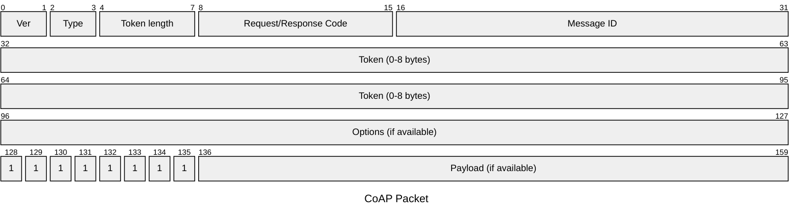

# CoAP 2 MQTT Bridge
- aiocoap (Python)
- MQTT
- Telegraf
- InfluxDB
- Grafana

The CoAP server will relay all messaged received under the `sensor/data` endpoint.

## Launch
```bash
# Need to be run every time you update the Python file
docker compose --profile tig build --no-cache

# Start with the TIG Stack
docker compose --profile tig up --detach

# Start only the CoAP & MQTT Server
docker compose --profile mqtt up --detach
```

```bash
docker exec -it iot-ws24-influxdb-1 influx auth list
docker exec -it iot-ws24-influxdb-1 influx telegrafs
```

## Environment Variables
- `COAP_BIND_NAME`
- `COAP_PORT`
- `MQTT_SERVER`
- `MQTT_PORT`
- `MQTT_USER`
- `MQTT_PASSWORD`

## CoAP Cheat Sheet


- GET: Code 0.01 (or 1 in hexadecimal).
- POST: Code 0.02 (or 2 in hexadecimal).
- PUT: Code 0.03 (or 3 in hexadecimal).
- DELETE: Code 0.04 (or 4 in hexadecimal).
